# Itinerary Plus (NestJS)

Contract-first API to sort travel tickets into a complete itinerary and render a human-readable version.

## Development Setup

### Prerequisites

- Node.js >= 18
- Yarn package manager
- Docker (for PostgreSQL database)

### Installation

1. **Clone the repository**:

   ```bash
   git clone <repository-url>
   cd itinerary-plus
   ```

2. **Install dependencies**:

   ```bash
   yarn install
   ```

3. **Set up pre-commit hooks** (automatically configured):
   ```bash
   # Husky and lint-staged are already configured
   # Pre-commit hooks will run automatically on git commit
   ```

### Development Scripts

The project includes comprehensive development tools and scripts:

#### Code Quality & Formatting

- **`yarn format`**: Format all TypeScript files with Prettier
- **`yarn format:check`**: Check if files are properly formatted
- **`yarn lint`**: Run ESLint to check code quality
- **`yarn lint:fix`**: Automatically fix ESLint issues

#### Pre-commit Hooks

The project uses **Husky** and **lint-staged** to ensure code quality:

- **Automatic formatting**: All staged files are formatted with Prettier
- **Linting**: TypeScript files are linted and auto-fixed with ESLint
- **Git integration**: Changes are automatically staged after formatting

**What happens on commit:**

1. Prettier formats all staged files (`.ts`, `.js`, `.json`, `.md`, `.yml`, `.yaml`)
2. ESLint fixes issues in TypeScript files
3. All changes are automatically staged
4. Commit message is validated against conventional commit standards
5. Commit proceeds if all checks pass

#### Conventional Commits

The project enforces **Conventional Commits** standard for consistent commit messages:

- **Interactive Commit Creation**: Use `yarn commit` for guided commit message creation
- **Automatic Validation**: All commit messages are validated against conventional standards
- **Semantic Versioning**: Commit types help with automatic versioning and changelog generation

**Available Commit Types:**

- `feat`: New features
- `fix`: Bug fixes
- `docs`: Documentation changes
- `style`: Code style changes (formatting, etc.)
- `refactor`: Code refactoring
- `perf`: Performance improvements
- `test`: Adding or updating tests
- `chore`: Maintenance tasks, dependencies, etc.
- `ci`: CI/CD changes
- `build`: Build system changes
- `revert`: Revert previous commits

**Example Commit Workflow:**

```bash
# Stage your changes
git add .

# Use interactive commit tool
yarn commit

# Or commit directly (will be validated)
git commit -m "feat: add new ticket sorting algorithm"
```

#### Testing

- **`yarn test`**: Run unit tests
- **`yarn test:watch`**: Run tests in watch mode
- **`yarn test:cov`**: Run tests with coverage report
- **`yarn test:e2e`**: Run end-to-end tests

**Testing Strategy:**

The application follows a comprehensive testing strategy with unit tests for services and e2e tests for API endpoints. See [TESTING.md](./TESTING.md) for detailed testing patterns and examples.

**Current Test Coverage:**

- ✅ **All Services**: 95.47% overall coverage (269 tests passing)
- ✅ **Unit Tests**: Complete coverage for all services, repositories, and controllers
- ✅ **E2E Tests**: 15 comprehensive API endpoint tests

**Coverage Requirements:**

- 80% minimum coverage for all tested services
- See [TESTING.md](./TESTING.md) for detailed coverage configuration

#### Database Management

- **`yarn migration:run`**: Apply pending migrations
- **`yarn migration:revert`**: Revert last migration
- **`yarn migration:generate`**: Generate new migration from entity changes
- **`yarn schema:sync`**: Sync database schema (development only)

#### Application

- **`yarn start:dev`**: Start development server with hot reload
- **`yarn start:debug`**: Start with debugging enabled
- **`yarn build`**: Build for production

### Code Style & Standards

The project enforces consistent code style through:

- **Prettier**: Automatic code formatting with consistent rules
- **ESLint**: Code quality and best practices enforcement
- **TypeScript**: Strict type checking and modern JavaScript features

**Configuration files:**

- `.prettierrc`: Prettier formatting rules
- `.prettierignore`: Files to exclude from formatting
- `eslint.config.mjs`: ESLint configuration
- `.husky/pre-commit`: Git pre-commit hook
- `.husky/commit-msg`: Git commit-msg hook for conventional commits
- `commitlint.config.js`: Commit message validation rules

## Mock the API (no backend needed)

You can mock the endpoints from the OpenAPI contract immediately.

### Prerequisites

- Node.js >= 18

### Using Prism (recommended)

1. Install Prism CLI (globally or via npx):

   ```bash
   npx @stoplight/prism-cli@5 mock openapi.yaml
   ```

2. Prism will start a mock server (default on `http://127.0.0.1:4010`).

3. Try the examples:
   - Create itinerary (201)

     ```bash
     curl -i \
       -H "Content-Type: application/json" \
       -H "Idempotency-Key: demo-123" \
       --data @examples/create-itinerary-request.json \
       http://127.0.0.1:4010/v1/itineraries
     ```

   - Retrieve by id (200 JSON)

     ```bash
     curl -i http://127.0.0.1:4010/v1/itineraries/5b4cc1f8-6e2b-43a2-9c19-2d83f7b16f5b
     ```

   - Retrieve human-readable (text/plain)

     ```bash
     curl -i -H "Accept: text/plain" http://127.0.0.1:4010/v1/itineraries/5b4cc1f8-6e2b-43a2-9c19-2d83f7b16f5b
     ```

   - Example business error (422)
     ```bash
     curl -i \
       -H "Content-Type: application/json" \
       --data @examples/error-422.json \
       http://127.0.0.1:4010/v1/itineraries
     ```

### Notes

- Spec version: OpenAPI 3.1.0 (`openapi.yaml`).
- No authentication in v1.
- Status codes: 201 (create), 200 (get), 400, 404, 409, 422, 500.
- Extensible tickets via `type` discriminator: train, tram, bus, boat, flight, taxi.

---

## API contract (summary)

- POST `/v1/itineraries`
  - Body:
    ```json
    {
      "tickets": [
        {
          "type": "train",
          "from": { "name": "St. Anton am Arlberg Bahnhof" },
          "to": { "name": "Innsbruck Hbf" },
          "number": "RJX 765",
          "platform": "3",
          "seat": "17C"
        },
        {
          "type": "tram",
          "from": { "name": "Innsbruck Hbf" },
          "to": { "name": "Innsbruck Airport" },
          "line": "S5"
        },
        {
          "type": "flight",
          "from": { "name": "Innsbruck Airport", "code": "INN" },
          "to": { "name": "Venice Airport", "code": "VCE" },
          "flightNumber": "AA904",
          "gate": "10",
          "seat": "18B",
          "baggage": "self-check-in"
        }
      ],
      "render": "both"
    }
    ```
  - 201 Response (JSON):
    ```json
    {
      "id": "5b4cc1f8-6e2b-43a2-9c19-2d83f7b16f5b",
      "start": { "name": "St. Anton am Arlberg Bahnhof" },
      "end": { "name": "Venice Airport", "code": "VCE" },
      "items": [
        {
          "index": 0,
          "type": "train",
          "from": { "name": "St. Anton am Arlberg Bahnhof" },
          "to": { "name": "Innsbruck Hbf" },
          "number": "RJX 765",
          "platform": "3",
          "seat": "17C"
        },
        {
          "index": 1,
          "type": "tram",
          "from": { "name": "Innsbruck Hbf" },
          "to": { "name": "Innsbruck Airport" },
          "line": "S5"
        },
        {
          "index": 2,
          "type": "flight",
          "from": { "name": "Innsbruck Airport", "code": "INN" },
          "to": { "name": "Venice Airport", "code": "VCE" },
          "flightNumber": "AA904",
          "gate": "10",
          "seat": "18B",
          "baggage": "self-check-in"
        }
      ],
      "stepsHuman": [
        "0. Start.",
        "1. Board train RJX 765, Platform 3 from St. Anton am Arlberg Bahnhof to Innsbruck Hbf. Seat number 17C.",
        "2. Board the Tram S5 from Innsbruck Hbf to Innsbruck Airport.",
        "3. From Innsbruck Airport, board the flight AA904 to Venice Airport from gate 10, seat 18B. Self-check-in luggage at counter.",
        "4. Last destination reached."
      ],
      "createdAt": "2025-08-08T10:00:00Z"
    }
    ```
  - Headers: optional `Idempotency-Key` (request), `Location` (response)
  - Errors: 400 validation, 409 idempotency conflict, 422 disconnected itinerary

- GET `/v1/itineraries/{id}`
  - 200 Response (JSON): same shape as above
  - `Accept: text/plain` returns human-readable itinerary (one step per line)

- GET `/v1/itineraries/{id}/human`
  - 200 Response (text/plain): same human-readable content

### Ticket model (input)

- Common fields: `type`, `from.name`, `to.name`, optional `seat`, `notes`, `meta`
- By `type`:
  - train: `number`, `platform`, `line?`
  - tram: `line`
  - bus: `service`
  - boat: `vessel`
  - flight: `airline?`, `flightNumber` (required), `gate?`, `baggage` (auto-transfer | self-check-in | counter)
  - taxi: `provider?`

---

## Postman import note

Postman may show "Too many levels of nesting to fake this schema" when importing OpenAPI 3.1 with `oneOf` + `allOf` inheritance.

Workarounds:

- Prefer Swagger UI or Prism for mocking.
- Or switch the spec to OpenAPI 3.0.3 and reduce `allOf` depth (e.g., avoid `ItineraryItem` inheriting from `Ticket`).
- Or keep the spec as-is and rely on the concrete JSON examples in `examples/` for Postman requests.

## Implementation Status

This project follows a contract-first approach with systematic layered development:

### ✅ Phase 1: Contract & API Design (Completed)

- **DTOs and Entities**: Created comprehensive data transfer objects and entity models for tickets, places, and itineraries
- **OpenAPI Specification**: Defined complete API contract in `openapi.yaml` with proper validation schemas
- **Swagger Integration**: Set up Swagger UI for API documentation and testing
- **Mock Samples**: Provided JSON examples in `examples/` directory to support other teams for mocking and testing

### ✅ Phase 2: Database Layer (Completed)

- **Docker Setup**: Created containerized PostgreSQL database environment
- **TypeORM Integration**: Configured TypeORM with proper entity relationships and migrations
- **Entity Refinement**: Added TypeORM decorators to all entities with proper relationships and constraints
- **Database Migration**: Generated and executed initial schema migration, all tables created successfully

#### Database Setup

1. **Start the PostgreSQL database**:

   ```bash
   docker-compose up -d postgres
   ```

2. **Database Configuration**:
   - **Host**: localhost
   - **Port**: 5433 (to avoid conflicts with existing PostgreSQL installations)
   - **Database**: itinerary_plus
   - **Username**: kevin
   - **Password**: mcallister2024

3. **Verify database is running**:

   ```bash
   docker-compose ps
   ```

4. **Access database directly** (if needed):

   ```bash
   docker exec -it itinerary-plus-db psql -U kevin -d itinerary_plus
   ```

5. **Stop database**:
   ```bash
   docker-compose down
   ```

#### TypeORM Setup

After starting the database, you can use TypeORM commands for database management:

1. **Environment Variables**: Create a `.env` file (optional, defaults work with Docker setup):

   ```bash
   # Database Configuration
   DB_HOST=localhost
   DB_PORT=5433
   DB_USERNAME=kevin
   DB_PASSWORD=mcallister2024
   DB_NAME=itinerary_plus

   # Application
   PORT=3000
   NODE_ENV=development
   ```

2. **Test database connection**:

   ```bash
   yarn typeorm query "SELECT version()"
   ```

3. **Available TypeORM commands**:

   ```bash
   # Generate migration from entity changes
   yarn migration:generate src/migrations/MigrationName

   # Create empty migration file
   yarn migration:create src/migrations/MigrationName

   # Run pending migrations
   yarn migration:run

   # Revert last migration
   yarn migration:revert

   # Sync schema (development only)
   yarn schema:sync

   # Drop all tables
   yarn schema:drop
   ```

4. **Run initial migration** (first time setup):

   ```bash
   yarn migration:run
   ```

5. **Verify database setup**:

   ```bash
   # Check tables were created
   yarn typeorm query "SELECT table_name FROM information_schema.tables WHERE table_schema = 'public' ORDER BY table_name;"

   # Test application startup
   yarn start:dev
   ```

#### Entity Structure

The database uses a well-structured entity model with the following relationships:

**Core Entities:**

- **Place**: Stores transportation hubs (airports, stations, etc.) with optional codes
- **Ticket** (Abstract): Base entity using Single Table Inheritance for all ticket types
  - **FlightTicket**: Airlines, flight numbers, gates, baggage handling
  - **TrainTicket**: Train lines, numbers, platforms
  - **BusTicket**: Routes and operators
  - **TramTicket**: Tram lines
  - **BoatTicket**: Vessels and docks
  - **TaxiTicket**: Companies, drivers, vehicle IDs
- **Itinerary**: Complete travel plans with start/end places
- **ItineraryItem**: Ordered tickets within an itinerary

**Key Design Decisions:**

- **UUID Primary Keys**: All entities use UUID for better distribution and security
- **Single Table Inheritance**: All ticket types stored in one table with a discriminator column
- **Eager Loading**: Place relationships are eagerly loaded for performance
- **JSONB Columns**: Flexible storage for metadata and human-readable steps
- **Unidirectional Relationships**: Simplified entity relationships to avoid circular dependencies

#### Repository Layer

The data access layer uses custom repositories that extend TypeORM functionality:

**PlaceRepository**:

- `findOrCreate(name, code?)`: Auto-create places if they don't exist with smart code updating
- `findByNameAndCode()`: Efficient lookup with optional code matching
- `findByNameOnly()`: Name-based lookup for unique name constraint
- `findByNames()`: Batch operations for multiple places
- `updatePlaceCode()`: Update existing place with new code information

**Place Name Uniqueness**: Places are uniquely identified by name with database-level unique constraints. When a place exists without a code and a ticket provides a code for the same place name, the existing place is automatically updated with the new code rather than creating a duplicate.

**TicketRepository**:

- `createTicket()`: Polymorphic ticket creation with proper inheritance
- `findByFromPlace()` / `findByToPlace()`: Route-based queries for sorting
- `saveMultiple()`: Batch ticket creation with transactions

**ItineraryRepository**:

- `create()`: Complete itinerary creation with start/end places
- `findByRoute()`: Find existing itineraries for similar routes
- `findRecent()`: Analytics and recent activity tracking

**ItineraryItemRepository**:

- `createMultiple()`: Ordered ticket sequence creation
- `findByItineraryId()`: Retrieve sorted items for an itinerary
- `getMaxIndexForItinerary()`: Support for incremental additions

### ✅ Phase 3: Service Layer (Completed)

- **Repository Layer**: Custom repositories with TypeORM for data access abstraction ✅
- **Sorting Algorithm**: Directed graph algorithm with comprehensive validation and error reporting ✅
- **Service Implementation**: Business logic layer with detailed user feedback ✅
- **Human Formatter**: Convert sorted tickets to readable instructions ✅

#### Itinerary Sorting Algorithm

The sorting service uses a **directed graph algorithm** specifically designed for **user experience and detailed validation** over performance optimization. This approach is ideal for travel itineraries because we prioritize user feedback and expect small datasets (typical itineraries have 5-15 tickets, not thousands).

**Algorithm Overview:**

The algorithm works in 6 phases:

1. **Basic Validation**: Check ticket validity and basic requirements
2. **Graph Construction**: Build a directed graph where places are nodes and tickets are edges
3. **Graph Structure Validation**: Analyze the graph for topological correctness
4. **Start/End Detection**: Find the unique start and end points using degree analysis
5. **Graph Traversal**: Walk through the graph to sort tickets in order
6. **Final Validation**: Verify the resulting sequence is complete and connected

**Visual Example:**

Here's how the algorithm works with a sample itinerary:

```mermaid
graph LR
    A["St. Anton<br/>(out: 1, in: 0)<br/>🟢 START"]
    B["Innsbruck Hbf<br/>(out: 1, in: 1)"]
    C["Innsbruck Airport<br/>(out: 1, in: 1)"]
    D["Venice Airport<br/>(out: 0, in: 1)<br/>🔴 END"]

    A -->|"Train RJX 765<br/>Platform 3, Seat 17C"| B
    B -->|"Tram S5"| C
    C -->|"Flight AA904<br/>Gate 10, Seat 18B"| D

    style A fill:#90EE90
    style D fill:#FFB6C1
    style B fill:#87CEEB
    style C fill:#87CEEB
```



**Key Algorithm Features:**

**Degree Analysis for Start/End Detection:**

- **Start place**: `outDegree > inDegree` (more departures than arrivals)
- **End place**: `inDegree > outDegree` (more arrivals than departures)
- **Middle places**: `inDegree = outDegree` (balanced connections)

**Comprehensive Error Detection:**

- **Multiple branches**: Place has `outDegree > 1` (warns about route options)
- **Circular routes**: Revisiting already visited places during traversal
- **Disconnected segments**: Gaps between consecutive tickets in final sequence
- **Invalid endpoints**: No clear start/end or multiple possible starting points
- **Isolated places**: Places with no incoming or outgoing connections

**Enhanced Error Messages for Disconnected Routes:**

The sorting algorithm includes sophisticated **disconnected component detection** that provides highly detailed user feedback when tickets form multiple separate route segments instead of a single connected itinerary.

**Example Scenario:**

Given tickets that form two disconnected segments:

- **Segment 1**: Venice train → Bologna bus → Paris flight → Chicago flight
- **Segment 2**: St. Anton train → Innsbruck tram → Venice flight

The algorithm identifies that a connection between "Venice Airport" (end of segment 2) and "Gara Venetia Santa Lucia" (start of segment 1) would create a complete single itinerary.

**Benefits:**

✅ **Actionable**: Users know exactly which connections are missing  
✅ **Diagnostic**: Clear understanding of route structure helps identify input errors  
✅ **Developer-Friendly**: Makes debugging route issues much easier  
✅ **Business-Friendly**: Provides insights that could drive product decisions about route optimization

### ✅ Phase 4: Controller Layer (Completed)

- **Controller Implementation**: Complete integration with service layer ✅
- **Request/Response Handling**: HTTP error handling with proper status codes (400, 404, 422, 500) ✅
- **API Contract Compliance**: All endpoints match OpenAPI specification exactly ✅
- **Content Negotiation**: Support for JSON and text/plain responses via Accept headers ✅

### ✅ Phase 5: Testing Layer (Completed)

- **Unit Tests**: Comprehensive Jest test coverage for all services, repositories, and controllers ✅
- **Integration Tests**: End-to-end tests for API endpoints ✅
- **Test Coverage**: 95.47% overall coverage with 269 tests passing ✅

**Current Test Statistics:**

- **Unit Tests**: 9 test suites covering all business logic
- **E2E Tests**: 15 comprehensive API endpoint tests
- **Coverage**: 95.47% statements, 83.92% branches, 100% functions, 95.32% lines
- **All Tests Passing**: 269/269 tests pass successfully

### Database Design Notes

The current implementation creates a simplified data model where the `create itinerary` endpoint will:

- **Auto-create places and tickets**: If places or tickets don't exist in the database, they will be created automatically
- **Accept some redundancy**: Initially, tickets may contain duplicate information (e.g., multiple flight tickets for the same flight but different seats)

**Future Enhancement Opportunities:**

- **Granular flight data**: Extract shared flight information (airline, flight number, departure time, aircraft type) into a separate `Flight` entity
- **Train service normalization**: Create a `TrainService` entity with train number, route, operator, and schedule that multiple train tickets can reference
- **Bus route optimization**: Implement `BusRoute` entities containing service number, operator, and route details shared across multiple bus tickets
- **Boat/Ferry services**: Extract vessel information, operator, and route into reusable `BoatService` entities
- **Transportation hubs**: Create `TransportationHub` entities for airports, train stations, and bus terminals with detailed facility information
- **Ticket normalization**: Create relationships where multiple tickets can reference the same underlying transportation service
- **Optimized storage**: Reduce data duplication by normalizing transportation services and shared infrastructure

_Note: The granular normalization is not in scope for the current implementation, prioritizing rapid development and API functionality._

---

## Next Steps (implementation)

- ✅ Complete TypeORM entity relationships and migrations
- ✅ Implement service layer with sorting algorithm
- ✅ Implement human-readable formatter service
- ✅ Wire up controllers with proper validation
- ✅ Complete comprehensive testing suite
- 🚧 **Ready for Production**: All core functionality implemented and tested
