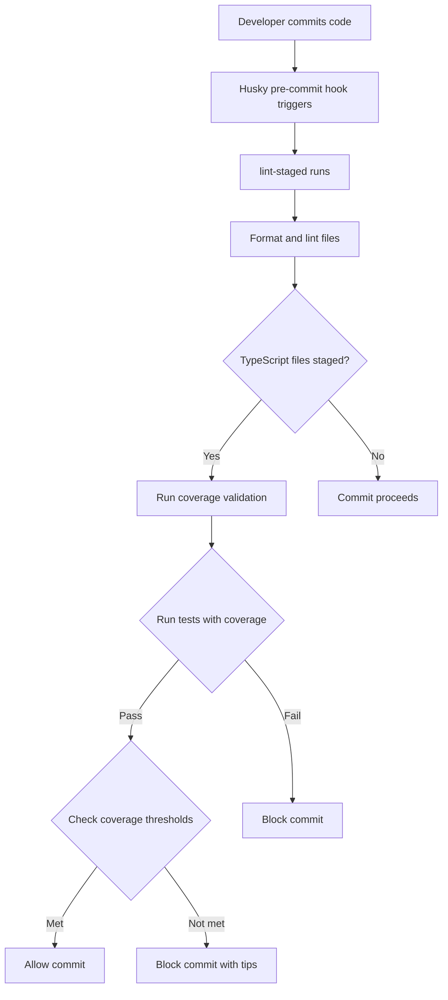

# Strict Test Coverage Setup

This document describes the strict test coverage validation system implemented in the Itinerary Plus project.

## Overview

The project now includes a comprehensive test coverage validation system that ensures all code changes maintain high test coverage standards. This system is integrated into the Git pre-commit workflow using Husky and lint-staged.

## Features

### 🎯 Coverage Thresholds

- **Branches**: 80%
- **Functions**: 80%
- **Lines**: 80%
- **Statements**: 80%

### 🔧 Automated Validation

- Pre-commit hook integration
- Automatic coverage reporting
- Detailed coverage analysis
- Helpful error messages and tips

### 📊 Coverage Reports

- Text-based console output
- LCOV format for CI/CD integration
- JSON summary for programmatic access
- HTML reports for detailed analysis

## How It Works

### Pre-commit Hook Flow



### Coverage Validation Process

1. **File Detection**: Identifies staged TypeScript source files (excludes test files)
2. **Test Execution**: Runs the full test suite with coverage reporting
3. **Threshold Validation**: Checks if coverage meets minimum thresholds
4. **Result Handling**:
   - ✅ **Success**: Commit proceeds
   - ❌ **Failure**: Commit blocked with helpful error messages

## Configuration Files

### Jest Configuration (`jest.config.js`)

```javascript
module.exports = {
  // ... other config
  coverageReporters: ['text', 'lcov', 'json-summary'],
  coverageThreshold: {
    global: {
      branches: 80,
      functions: 80,
      lines: 80,
      statements: 80,
    },
  },
};
```

### Pre-commit Hook (`.husky/pre-commit`)

```bash
npx lint-staged

# Run test coverage check for staged TypeScript files
if git diff --cached --name-only --diff-filter=ACM | grep -q "\.ts$"; then
  echo "🧪 Running test coverage validation..."
  npm run test:cov:check
fi
```

### Package.json Scripts

```json
{
  "scripts": {
    "test:cov": "jest --coverage",
    "test:cov:strict": "jest --coverage --coverageReporters=text --coverageReporters=lcov --coverageReporters=json-summary",
    "test:cov:check": "node scripts/check-coverage.js"
  }
}
```

## Usage

### For Developers

#### Normal Development Workflow

```bash
# Make changes to TypeScript files
git add .
git commit -m "feat: add new functionality"
# Pre-commit hook automatically runs coverage validation
```

#### Manual Coverage Check

```bash
# Check coverage without committing
npm run test:cov:check
```

#### View Detailed Coverage Report

```bash
# Generate and view HTML coverage report
npm run test:cov
# Open coverage/lcov-report/index.html in browser
```

### For CI/CD

The coverage system integrates seamlessly with CI/CD pipelines:

```yaml
# Example GitHub Actions workflow
- name: Run tests with coverage
  run: npm run test:cov:strict

- name: Upload coverage to Codecov
  uses: codecov/codecov-action@v3
  with:
    file: ./coverage/lcov.info
```

## Coverage Validation Script

The `scripts/check-coverage.js` script provides:

### Features

- **Smart File Detection**: Only processes TypeScript source files
- **Comprehensive Reporting**: Detailed coverage breakdown
- **Helpful Error Messages**: Tips for improving coverage
- **Color-coded Output**: Easy-to-read console output

### Output Example

```
🧪 Running pre-commit test coverage validation...
📝 Found 2 staged TypeScript files:
  - src/place/place.repository.ts
  - src/place/place.service.ts

Running tests with coverage...
✅ Tests completed successfully

📊 Coverage Summary:
Branches: 85% (threshold: 80%) ✅
Functions: 90% (threshold: 80%) ✅
Lines: 88% (threshold: 80%) ✅
Statements: 87% (threshold: 80%) ✅

✅ All coverage thresholds met!
🎉 Pre-commit coverage validation passed!
```

## Best Practices

### Writing Testable Code

1. **Keep functions small and focused**
2. **Use dependency injection**
3. **Avoid complex nested logic**
4. **Separate business logic from framework code**

### Maintaining High Coverage

1. **Test all public methods**
2. **Cover error scenarios**
3. **Test edge cases**
4. **Use meaningful test descriptions**

### Test Organization

1. **Group related tests in describe blocks**
2. **Use consistent naming conventions**
3. **Follow AAA pattern (Arrange, Act, Assert)**
4. **Mock external dependencies**

## Troubleshooting

### Common Issues

#### Coverage Thresholds Not Met

```
❌ Coverage thresholds not met. Please add more tests.

💡 Tips to improve coverage:
  - Add unit tests for new functions and methods
  - Test edge cases and error scenarios
  - Ensure all code paths are covered
  - Run "npm run test:cov" to see detailed coverage report
```

#### Tests Failing

- Check for syntax errors in test files
- Ensure all dependencies are installed
- Verify test environment setup

#### Pre-commit Hook Not Running

- Ensure Husky is properly installed: `npm run prepare`
- Check file permissions on `.husky/pre-commit`
- Verify lint-staged configuration

### Debugging Coverage Issues

1. **View Detailed Report**:

   ```bash
   npm run test:cov
   open coverage/lcov-report/index.html
   ```

2. **Check Specific File Coverage**:

   ```bash
   npm test -- --coverage --collectCoverageFrom="src/place/place.repository.ts"
   ```

3. **Run Tests in Watch Mode**:
   ```bash
   npm run test:watch
   ```

## Customization

### Adjusting Coverage Thresholds

Edit `jest.config.js`:

```javascript
coverageThreshold: {
  global: {
    branches: 90,    // Increase to 90%
    functions: 85,   // Increase to 85%
    lines: 90,       // Increase to 90%
    statements: 90,  // Increase to 90%
  },
},
```

### Adding File-specific Thresholds

```javascript
coverageThreshold: {
  global: {
    branches: 80,
    functions: 80,
    lines: 80,
    statements: 80,
  },
  './src/critical-module/': {
    branches: 95,
    functions: 95,
    lines: 95,
    statements: 95,
  },
},
```

### Excluding Files from Coverage

Edit `jest.config.js`:

```javascript
collectCoverageFrom: [
  '**/*.(t|j)s',
  '!**/*.constants.ts',
  '!**/*.module.ts',
  '!**/*.entity.ts',
  '!**/*.dto.ts',
  '!**/index.ts',
  '!**/main.ts',
  '!**/migrations/**',
  '!**/config/**',
  '!**/scripts/**',  // Add this line
],
```

## Integration with Other Tools

### VS Code Integration

Install the Jest extension for VS Code to see coverage inline:

```json
{
  "jest.showCoverageOnLoad": true,
  "jest.coverageFormatter": "DefaultFormatter"
}
```

### IDE Integration

Most modern IDEs support Jest coverage:

- **WebStorm**: Built-in Jest support
- **VS Code**: Jest extension
- **Atom**: jest package

## Monitoring and Reporting

### Coverage Trends

Track coverage over time using:

- **Codecov**: Automated coverage tracking
- **Coveralls**: Coverage history and trends
- **Custom dashboards**: Build your own reporting

### Team Metrics

- **Coverage goals**: Set team-wide coverage targets
- **Code review**: Require coverage checks in PRs
- **Automated alerts**: Notify when coverage drops

## Conclusion

The strict test coverage system ensures code quality and maintainability by:

1. **Enforcing Coverage Standards**: All code must meet minimum coverage thresholds
2. **Automating Validation**: No manual intervention required
3. **Providing Feedback**: Clear guidance on improving coverage
4. **Integrating Seamlessly**: Works with existing development workflows

This system helps maintain high code quality and reduces the risk of introducing bugs while ensuring comprehensive test coverage across the entire codebase.
